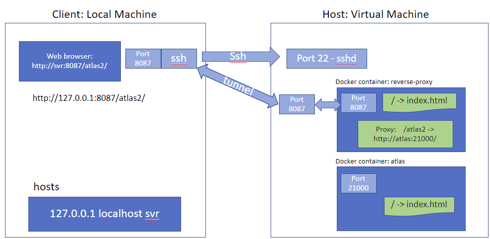
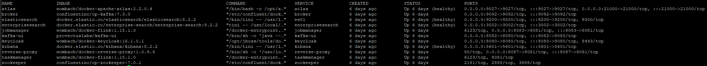
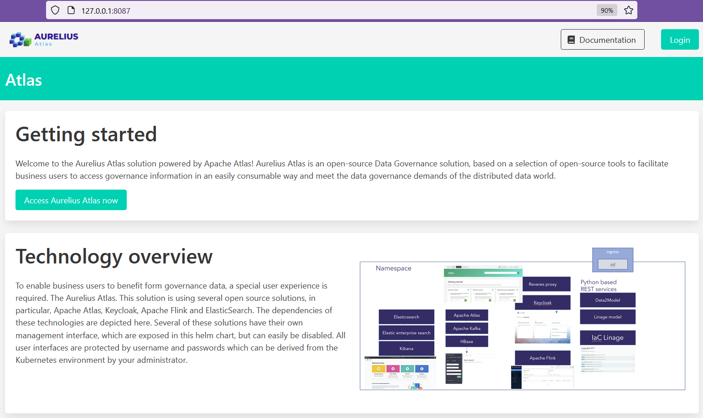

# How to deploy Aurelius Atlas with Docker Compose

Getting started
-------------------------
Welcome to Aurelius Atlas, a powerful data governance solution powered by Apache Atlas! Aurelius Atlas leverages a carefully curated suite of open-source tools to provide business users with seamless access to governance information. Our solution is designed to address the evolving demands of data governance in a distributed data environment, ensuring that you can easily consume and utilize valuable governance insights.

This guide provides comprehensive instructions for setting up the Docker Compose deployment and covers various deployment scenarios. You will find step-by-step instructions to configure the required setup and deploy the system.

## Description of system

The solution is based on Apache Atlas for metadata management and governance, and Apache Kafka is utilized within HBase. The original Apache Kafka user interface remains accessible. Additionally, an Apache server is implemented to handle frontend traffic. A custom interface has been developed to enable effective search functionality and full-text search capabilities, leveraging the power of the Elastic stack. This stack includes Elasticsearch, Enterprise Search, and Kibana. Keycloak serves as our identity provider. Apache Flink is employed to implement streaming jobs that consume Kafka events from Apache Atlas. These events are enriched and stored within Kafka topics as well as within the Elastic Enterprise Search.

## Installation Requirements
To deploy this solution you will need to install the following components:

Host:
- docker
- docker compose
- ssh server

Client:
- ssh client

Please ensure that you have these components installed on both the host and client machines for a successful deployment

## Hardware requirements
- 4 CPU cores 
- 32GB RAM 
- 100GB DISK

## How to connect to the docker-compose environment?
 For the client a local machine is required and for the host a VM or local machine can be used. Below we describe some possible scenarios for this deployment

### Deployment on local machine
- No additional action is required

### Deployment on VM with public domain name
- Connect to the VM using as destination its public IP

### Deployment on VM without public domain name

- Connect to the VM using as destination its private IP 

- Define a ssh tunnel to the IP of the VM
    ```
    8087 -> 127.0.0.1:8087
    ```

- Extend hosts file with the following line (admin right required)

    ```
    127.0.0.1       localhost localhost4 $EXTERNAL_IP
    ```

    This is a representation of the described deployment on VM:

      

## Preparatory Steps:

On the host:
1. Start docker (admin rights required):
    ```
    sudo service docker start
    ```

2. Obtain the IP address or hostname of the host machine's eth0 interface:
    
- If deployment is on local machine:

    ```
    export EXTERNAL_IP=$(ifconfig eth0 | grep 'inet' | cut -d: -f2 | sed -e 's/.*inet \([^ ]*\).*/\1/')
    ```

- If deployment is on a VM:

    ```
    export EXTERNAL_IP={hostname of VM}
    ```

3. Run the following script:
    ```
    ./retrieve_ip.sh
    ```

    This script updates the values of `$EXTERNAL_IP` within the templates used to generate the necessary configuration files for the various services.

4. Grant Elasticsearch sufficient virtual memory to facilitate its startup (admin rights required):

    ```
    sudo sysctl -w vm.max_map_count=262144
    ```
    For more details on configuring virtual memory for Elasticsearch, refer to this [page](https://www.elastic.co/guide/en/elasticsearch/reference/8.2/vm-max-map-count.html).

##  Environment variables responsible for user/pass
By default these roles are created in the different services:

- Elastic Admin User:  
Username: elastic  
Password: elasticpw

- Keycloak Admin user:  
Username: admin  
Password: admin

- Aurelius/Apache Atlas Admin User:  
Username: atlas  
Password: 1234

## Spin up docker-compose environment:
 
### On the host:

```
docker compose up -d
```

This is how the system looks in operational state:


When the Apache Atlas container state changes from starting to healthy, then the system is ready.


### On the client:

You are able now to access the reverse proxy at ```http://$EXTERNAL_IP:8087/```



You can find more information about the product in this [page](https://www.aurelius-atlas.com/docs/doc-technicall-manual/en/dev/Options/what.html)

#### Notes:

- How to restart Apache Atlas?
```
docker exec -it atlas /bin/bash
cd /opt/apache-atlas-2.2.0/bin/
python atlas_stop.py
python atlas_start.py
exit
```

- How to restart reverse proxy?
```
docker exec -it reverse-proxy /bin/bash
apachectl restart
```